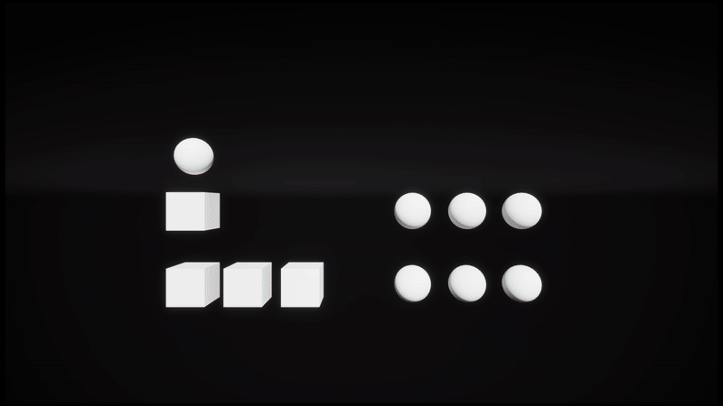

# Unreal Engine 5 Actor Interaction-System

This is a simple interaction system for actors. Each actor can function as a submitter, a receiver, or both, allowing you to create interaction chains between them.

## Included in demo

- Interaction-system code

For more demos and free content, visit my [Patreon](https://www.patreon.com/c/RescapeGames)

